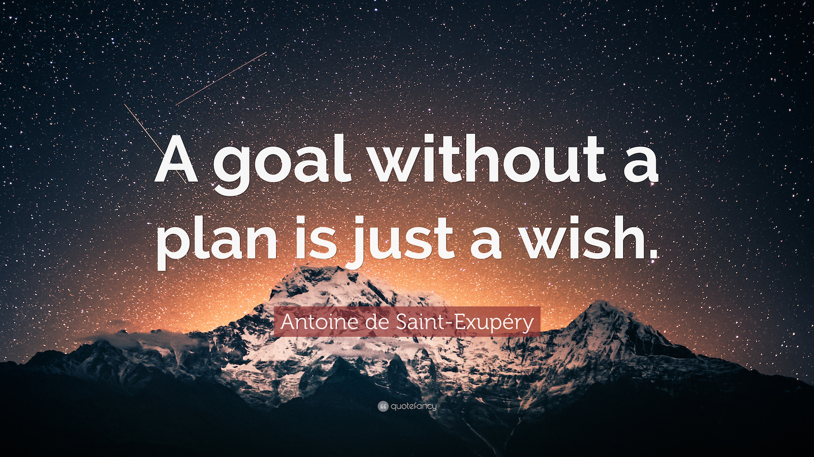
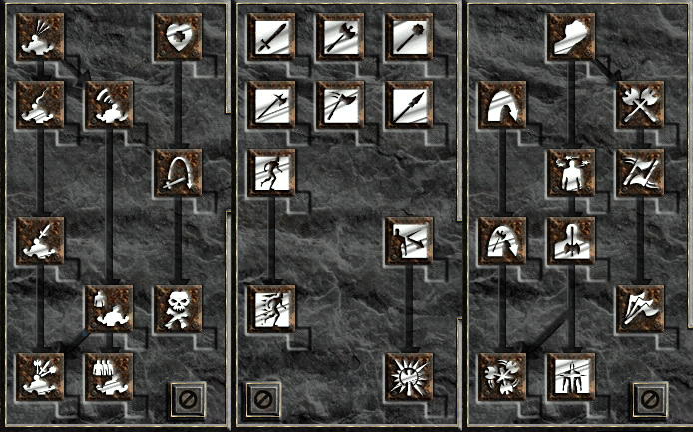

Nowadays a lot of people are interested in becoming a software developer. Some of them love computers and technologies and some of them just want to switch their job to a better paid one. The amount of software development courses and boot camps are instantly growing and there are more and more developers.

Nevertheless, the demand for developers is pretty high. IT companies are constantly looking for new developers. But they're looking for professionals who passionate about their job.

There are developers who work just for a paycheck and care only about the number of monitors they can have. Usually, they stuck somewhere in low positions doing stuff that they don't like and with fear to be fired.

I want you to ask yourself "**Why am I want to be a software developer?**". Stop reading, take a few minutes, write-down answer for this question.

If the answer is "just money" you may be surprised but there are a lot of other opportunities that might be much more lucrative.

Becoming a developer is a long way, hence I suggest you proceed only if you are curious about it or have passion. That's the things that'll help you to go through the long path of learning (which might never end and that's good).

You still here? Let's go to the learning process!

# Creating your learning plan

Have you ever played RPG games?

They have a system of quests and rewards. Everything seems simple, you know exactly what to do in order to reach what you want.

Also, they have skill trees, the same you have with software development.

*In our life we have tons of options and possibilities. We just need to find a plan to reach them.*

**The hardest thing is to begin.**

## Areas of software development

You might be wondering: “**What programming language should I learn?**"
In order to figure it out, we’ll need to take a look at different software development areas.

Here's a short table of software development areas and technologies used there:

| Area                   | Technologies                      |
| ---------------------- | --------------------------------- |
| Data science           | Python, R                         |
| Web - Front end        | HTML, CSS, JavaScript             |
| Web - Back end         | Java, C#, Python, Node.js         |
| Mobile - Android       | Java, Kotlin                      |
| Mobile - iOS           | Objective-C, Swift                |
| Desktop - Windows      | C#, C++, Qt, Java                 |
| Desktop - Linux        | C++, Qt, Python, Java             |
| Desktop - OS X         | Objective-C, Swift, C++, Qt, Java |
| Embedded               | C++, C, Assembly                  |
| Game development       | C++, Unreal engine, Unity         |

To begin just choose one area which seems most interesting to you. 
You can go to job posting sites and look at what jobs are trending now and pick technologies from there. It’ll help you to choose what technologies you should learn.

You can find a lot of books for programming languages and technologies.
The topic is so wide so it’s impossible to cover all technologies in one blog post.

But I can give you some resources that might be helpful no matter what technology you’ll choose.

As a first step, you can jump-in to learning a programming language or to start from basics.

The good scenario is to combine practical and theoretical knowledge, so try to find books or courses that’ll learn you not just how to write code but also how to think as a developer.

# Know the basics

No matter what technology you’ll choose you'll need to know the basics.
Most of the programming languages are C-like languages, hence if you know one programming language you’ll be comfortable working with other languages.

If you have the time it’ll be good to start from [**CS50**](https://en.wikipedia.org/wiki/CS50) course.

Also as a faculty reading, I’d suggest [**Code: The Hidden Language of Computer Hardware and Software**](https://www.amazon.com/Code-Language-Computer-Hardware-Software/dp/0735611319) by  Charles Petzold. It won’t teach you how to write code but that’s a good book that may give you some intel on how computers and programming languages were created.

**No matter what you choose - just start to learn it.**

# A programming language is just a tool

I’ve taken a long path from learning C++ and C# and currently I work with Java and JavaScript but I benefited from that knowledge that might seem unused. 

If you want to be a good developer you should understand that programming language is just a tool and it should solve problems.

If needed you can always switch to other programming languages, so don’t be afraid to learn new things :)
