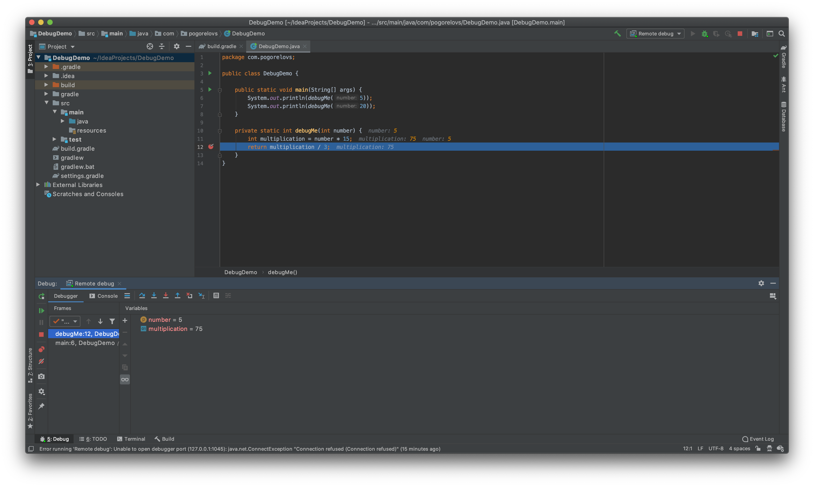
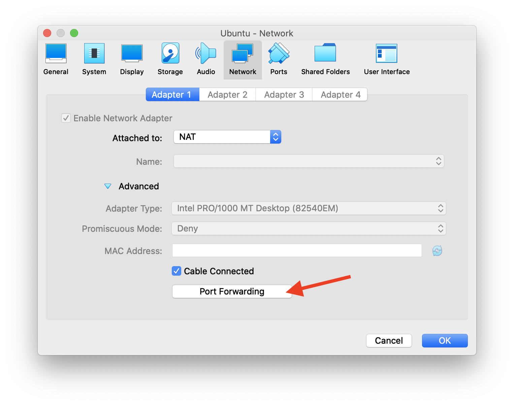
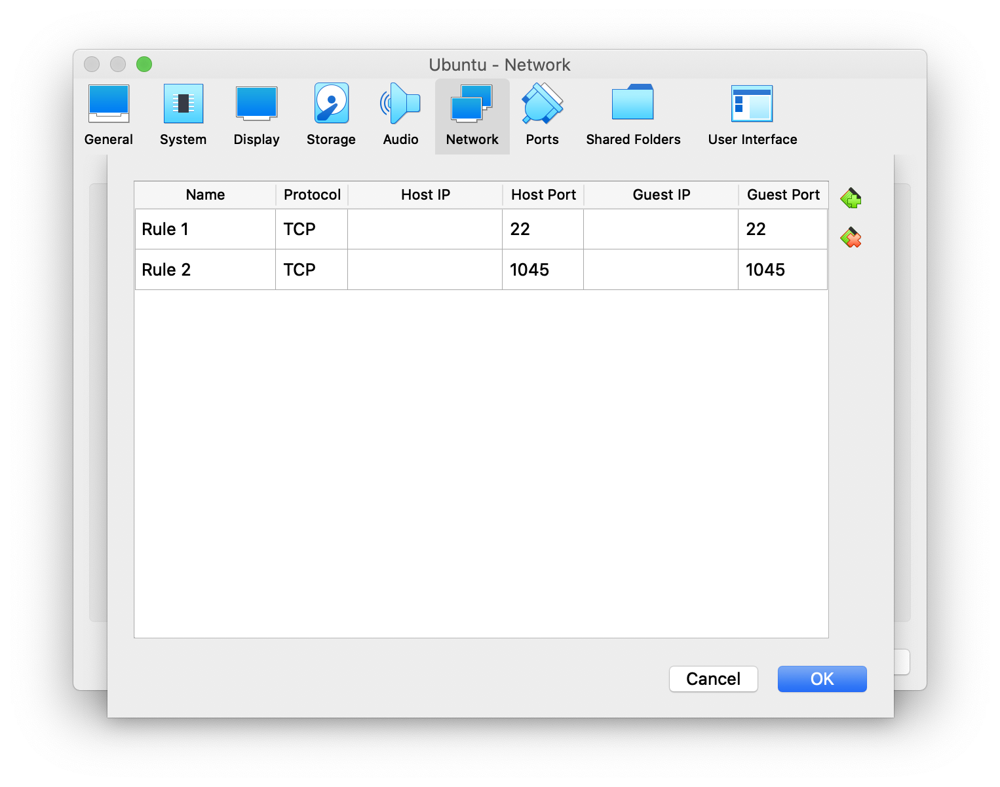

Sometimes it might be useful to debug remote applications that run on the remote server and not your local machine.

In order to do that  you need to use the following JVM options and connect with debugger.
```shell
-Xdebug -Xrunjdwp:transport=dt_socket,server=y,suspend=y,address=1045
```
Notice that here you can change *1045* to be any port what you want.
And suspend option is **y** so your application won't start work without connected debugger.

## Let's test it
The good news that you can test this approach on your local machine even without a remote server.

Just build your *JAR*, run it with these *JVM* options and connect with debugger.

### Let's do it on a simple example:
We can run it through the terminal

The `Listening for transport dt_socket at address: 1045` message means that our application listens on port `1045` and waits for debugger to connect.

We can create a new **Remote debug** configuration in the *IntelliJ IDEA*.


Now we can run our debugger and it'll attach to the remote process!


The debugging process wilk work on the same way with the remote machine!


## Let’s run it remotely
We’ll need a remote server or at least some system installed on VirtualBox.
For the simplicity we can use the VirtualBox with installed Ubuntu server.

First of all we need to open the ports required for SSH and debugging.



As a code for demo we’ll use very simple code:
```java
public class DebugDemo {

    public static void main(String[] args) {
        System.out.println(debugMe(5));
        System.out.println(debugMe(20));
    }

    private static int debugMe(int number) {
        int multiplication = number * 15;
        return multiplication / 3;
    }
}
```

Let's build the project and copy the *JAR* to out "remote" server:
```shell
gradle clean jar
scp build/libs/DebugDemo-1.0-SNAPSHOT.jar sergeioff@127.0.0.1:~/
```

Now we can run the *JAR* with our magical *JVM* options and we'll see the same result


We can connect with our favorite debugger and debug it!