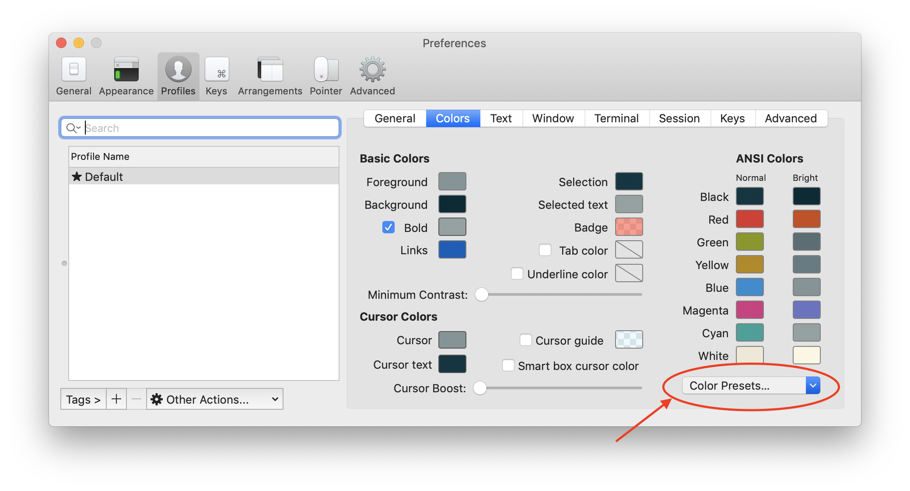
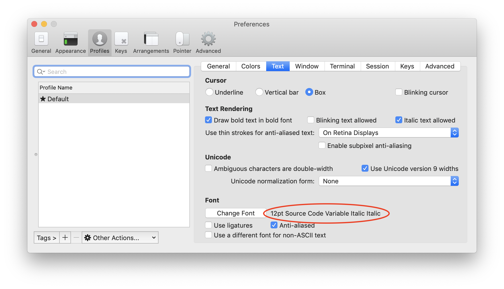
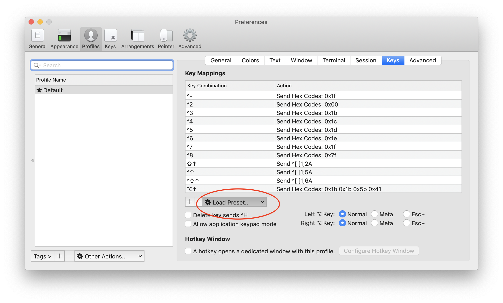
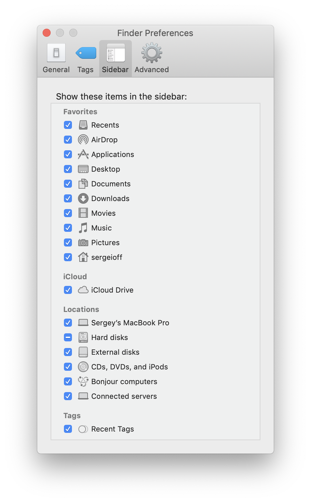

When I used Ubuntu as my main system I experimented a lot and often reinstalled the system. I’ve got to the conclusion that it might be handy to have a list of steps to do after a fresh system install.

Initially, I took a textbook and wrote down applications that I’ll need to install on a fresh system. With time I’ve decided to create a guide and put it to my GitHub. It stills [there](https://github.com/sergeioff/ubuntu-post-install). After all, I’ve realized that it’s possible to create a few scripts that will install everything for me.

Currently, I’m using OS X so I’ve decided to do the same script and guide for OS X.

## TLDR
- My post-install script:
<script src="https://gist.github.com/sergeioff/8cdb48d3fac3ca60d3f09e66d7a6b3df.js"></script>
- My .zshrc config:
<script src="https://gist.github.com/sergeioff/7e4447dcef3b02648726936a32938018.js"></script>

- install [Node.js](https://nodejs.org/en/)
	- install Yarn package manager:
	```
	sudo npm i -g yarn
	```

- install fixed font for terminal from
https://github.com/adobe-fonts/source-code-pro/releases/tag/variable-fonts

- iTerm2 profile setup
	- Select Solarized dark color scheme:
	
	- Select Source Code Variable Italic font:
	
	- Load natural text editing preset:
	

- In system settings:
	- Show battery percentage
	- Use stacks on Desktop
	- Disable Bluetooth
	- Link Google account (for calendar)
	- Disable "Show recent applications in Dock"
	- Show everything in Finder sidebar
	

This way simplifies a new environment setup and saves a lot of time since almost everything is automatized.